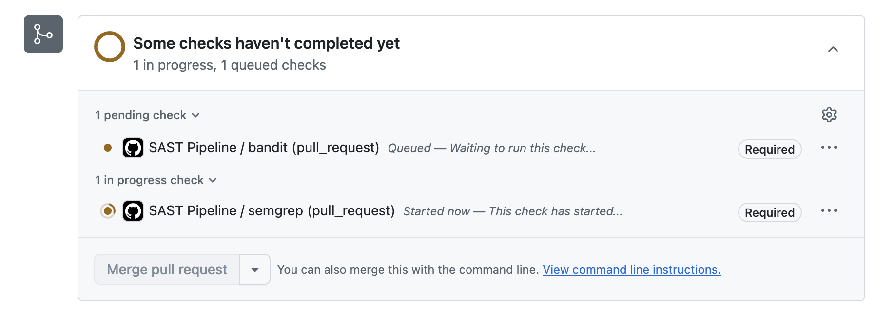
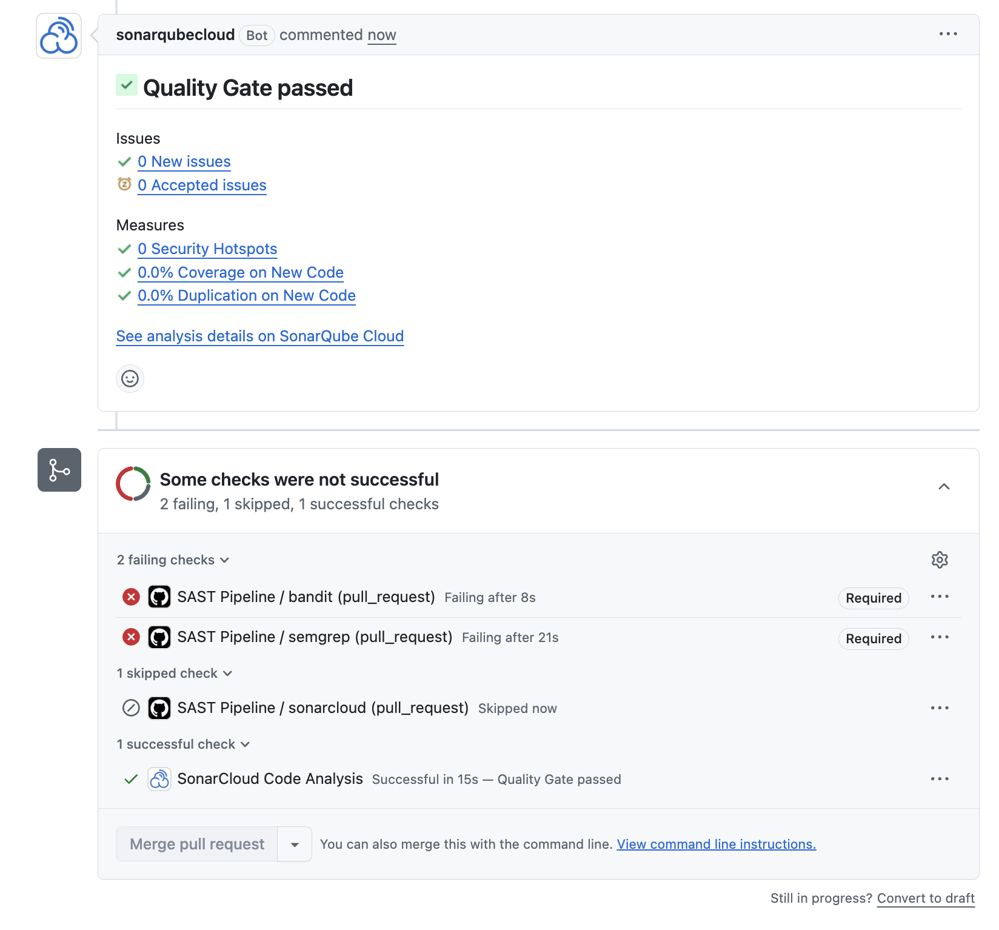
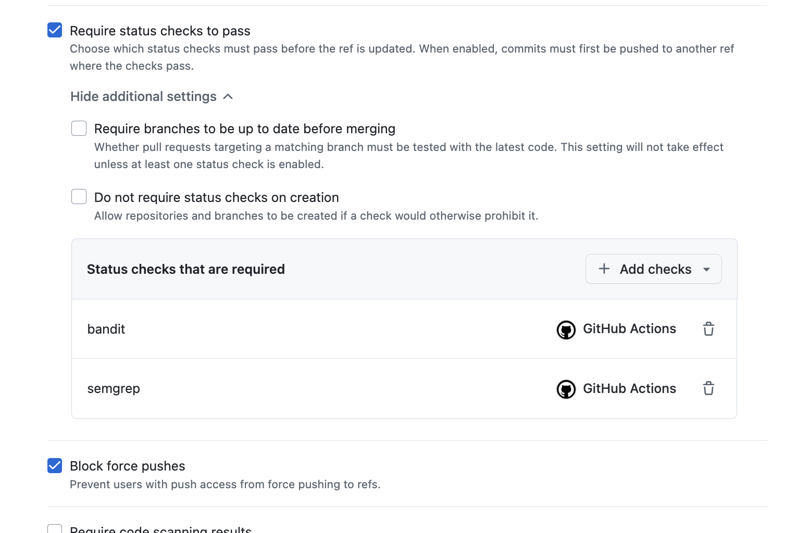
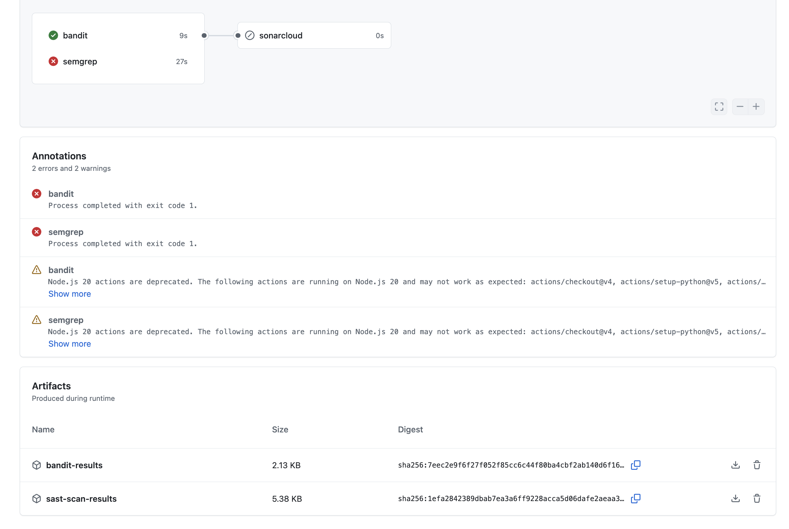
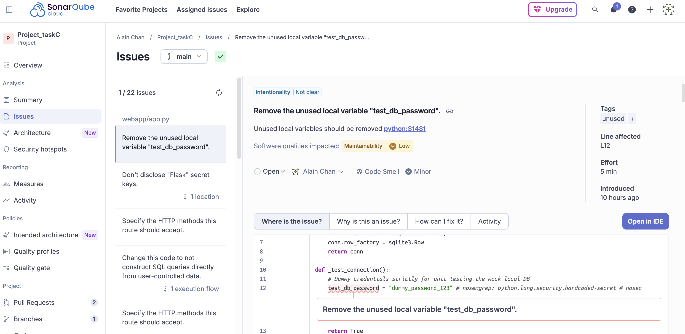

# Task C: Automated Security Testing

## Pipeline Architecture
The CI/CD pipeline leverages **GitHub Actions** to implement a proactive "Shift-Left" approach to security. Integrating security scans into the pull request process ensures that bad code is stopped before it merges into the main branch, which is a highly cost-effective strategy for identifying and fixing vulnerabilities early in the development lifecycle.

This pipeline operationalises **NIST SSDF v1.1 PW.7.1** ("Determine whether code has security vulnerabilities using automated tools") and **PW.8.2** ("Scope testing… to the risk context"). The Bandit, Semgrep, and SonarCloud triad provides redundant coverage satisfying PW.7.2's requirement to use multiple analysis techniques. Furthermore, pinning GitHub Actions to mutable tags introduces a supply chain risk into the pipeline itself; thus, all actions are strictly pinned to immutable SHA commit hashes to ensure a secure pipeline supply chain.

To optimize the pipeline's performance, **parallel jobs** are utilized, adhering to the "Fail Fast" methodology. Running the primary security scanners concurrently reduces the overall wait time for developers, providing quicker feedback.

The pipeline specifically incorporates four primary security layers:
* **Bandit**: Chosen for fast Python Static Application Security Testing (SAST). It effectively targets Python-specific vulnerabilities and coding errors. The build is configured to fail strictly on high-severity findings (`-ll`), acting as a robust security gate while minimizing lower-severity noise. The output is configured to export as JSON artifacts (`bandit_results.json`) to ensure findings are preserved.
* **Semgrep**: Selected for fast OWASP Web SAST. It is highly effective at identifying common web vulnerabilities and enforcing secure coding standards rapidly.
* **pip-audit (SCA)**: Added to provide Software Composition Analysis (SCA) for dependency vulnerability scanning. This layer verifies the components against a CVE database, seamlessly linking with the generation of the Software Bill of Materials (SBOM) in Task E to complete the scanning coverage.
* **SonarCloud**: Integrated for deep historical analysis. It tracks overall code quality, technical debt, and provides comprehensive long-term security metrics.

The SonarCloud job is configured with a `needs: [bandit, semgrep, sca]` dependency. This enforces a 'Fail-Fast' pipeline architecture; if the fast, lightweight scanners detect critical OWASP violations or vulnerable dependencies, the pipeline immediately halts, saving expensive cloud compute minutes that would otherwise be wasted on deep historical analysis.

## Finding Triage Summary
The SAST pipeline generated numerous findings. Below is a representative triage table detailing 10 distinct classifications from the scan results:

| Finding | Count | CWE | Classification | Resolution |
|---------|-------|-----|----------------|------------|
| SQL Injection (`f-string` queries) | 16 | CWE-89 | **True Positive** | Remediated in Task D via parameterised queries. |
| SQL Injection (Django rule on Flask) | 20 | CWE-89 | **False Positive (Framework mismatch)** | Rule to be disabled/ignored; requires tighter ruleset. |
| XSS (Flask raw HTML concat) | 4 | CWE-79 | **True Positive** | Refactor to Jinja2 `render_template()`. |
| XSS (Flask returned format string) | 4 | CWE-79 | **True Positive** | Refactor to Jinja2 `render_template()`. |
| XSS (Django raw HTML format) | 1 | CWE-79 | **False Positive (Framework mismatch)** | Rule to be disabled/ignored. |
| Flask `debug=True` | 1 | CWE-489 | **True Positive** | Gate via environment variable for production. |
| Dockerfile missing `USER` | 1 | CWE-250 | **True Positive** | Non-root `USER` directive added to the Dockerfile. |
| MD5 use (Semgrep built-in) | 1 | CWE-327 | **True Positive — Duplicate (Rule Overlap)** | Deduplicated with custom rule; replaced with SHA-256. |
| MD5 use (Custom `ban-hashlib-md5`) | 1 | CWE-327 | **True Positive — Duplicate (Rule Overlap)** | Replaced with SHA-256. |
| Hardcoded `dummy_password_123` | 1 | CWE-798 | **False Positive** | Suppressed via `# nosemgrep`. |

*(Note: Duplicate findings for MD5 showcase the necessity of rule deduplication to maintain a healthy signal-to-noise ratio).*

## Limitations Deep-Dive
While Static Application Security Testing (SAST) is essential, it has fundamental limitations. Semgrep OSS performs intra-procedural taint analysis but struggles with inter-procedural flows—for instance, if user input is sanitised in a helper function, the tool may still flag the sink as tainted. Critically, the scan surfaced numerous findings tagged `python.django.security.*` despite the target being a **Flask** application; this reveals that Semgrep's rule metadata is **language-scoped but not framework-scoped**, producing category false positives that a junior engineer might triage incorrectly. Additionally, some advanced Semgrep Pro rules are gated behind a login (`"fingerprint":"requires login"`), restricting the capabilities of the OSS engine.

Furthermore, SAST is structurally blind to authorisation flaws. The `/edit/<product_id>` route contains an Insecure Direct Object Reference (IDOR) where any seller can edit any product, which no static rule detected. This reinforces the thesis that SAST must be paired with Dynamic Application Security Testing (DAST) and manual review for complete coverage.

In DevSecOps theory, generating too many false positives creates **Alert Fatigue** and **Developer Friction**, potentially causing developers to ignore alerts or abandon the security pipeline altogether. Proper triage is critical to maintaining trust in the tooling. To demonstrate this "False Positive Avalanche" typical of context-blind static analysis, a dummy credential (`test_db_password = "dummy_password_123"`) was planted inside a unit testing function (`_test_connection`) in the `app.py` file. The context-blind SAST scanners flagged this hardcoded string as a critical security vulnerability, despite it not being a real production credential. This was resolved via "as-code risk acceptance" using the inline suppression comment `# nosemgrep: python.lang.security.hardcoded-secret`.

## True Positive Walkthrough
To demonstrate the pipeline failing on a real vulnerability, consider the SQL Injection (CWE-89) at line 26 of `app.py`:
```python
query = f"SELECT * FROM users WHERE username = '{logged_in_user}'"
```
Here, the source is the user-controlled `logged_in_user` cookie, and the sink is the database execution (`conn.execute`). The use of Python `f-strings` allows an attacker to manipulate the SQL statement. Because the Semgrep step in the CI pipeline runs with the `--error` flag, encountering this True Positive correctly breaks the build and prevents the pull request from merging. The remediation requires replacing the string interpolation with parameterised queries (e.g., `conn.execute("SELECT * FROM users WHERE username = ?", (logged_in_user,))`).

## Custom Rules
While standard rulesets are useful, advanced DevSecOps requires tailoring SAST tools to enforce strict corporate security policies. A custom Semgrep policy (`custom-rules.yaml`) was designed to ban the use of `hashlib.md5()`. A `bad_crypto.py` dummy file within the project intentionally triggers this custom rule. Both the custom rule and Semgrep's built-in `insecure-hash-algorithms-md5` fired on the exact same line, providing an excellent opportunity to discuss rule deduplication and signal-to-noise ratio. This highlights the ability to customize and extend static analysis tools beyond their default rulesets to meet specific organizational security requirements.

## Evidence
*Pipeline running*


*Failing on the SQLi*


*Blocked Pull Request (Branch Protection)*


*Artifacts extraction*


*Sonarcloud checks*

